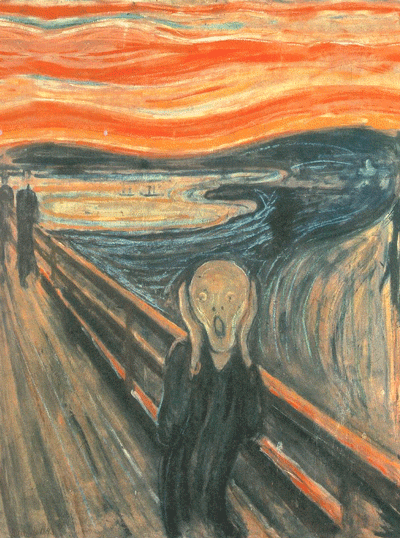
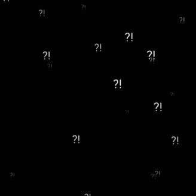
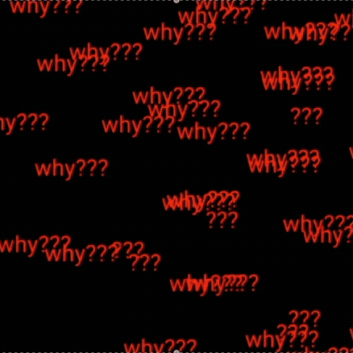
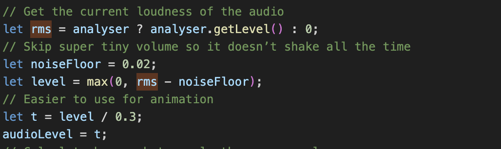
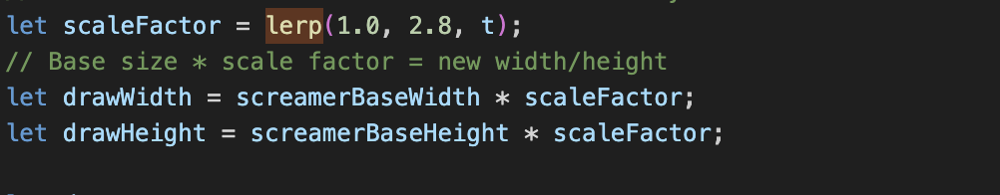
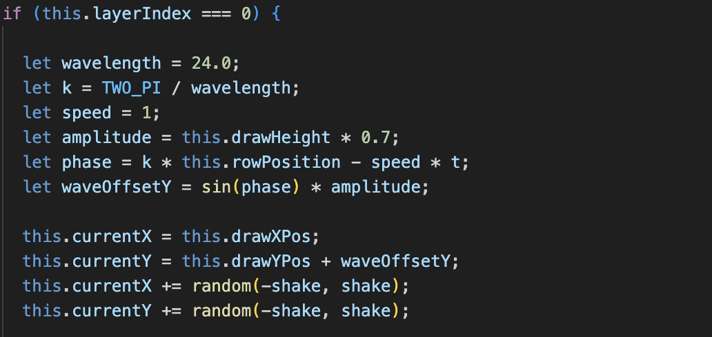

# jluo0156_9103_majorproject
# Major Project

## Part 1: How to interact with the work

- **How to Interact with the Work**
This project uses the audio track’s loudness to control visual changes. While the sound is playing, the program measures the audio level in real time and applies it to the animation. The viewer only needs to press Play/Pause to start or stop the audio. 
Note: The audio may be loud in some sections.
The full track is approximately 30 seconds long.
- **Person screaming**
The main figure in the image scales up and down according to the loudness of the audio. Higher volume results in a larger scale value and visible shaking when the audio becomes louder.
- **Background Line Movement**
The background layers are reconstructed using line segments. These segments shift slightly each frame, and the amount of movement increases as the audio becomes louder.

### Summary
The sketch reacts directly to the audio level. The viewer interacts by pressing Play/Pause, and all visual changes—scaling, shaking, and line movement—are controlled by the real-time amplitude of the sound.

---

# Chosen Interaction Method: **Audio**

# Part 2: Differences with Group Members

- **Sound-Driven Visual Effects**  
  While my group members used time-based transitions (e.g., light-to-dark background changes), my animation is fully audio-driven. The background line segments shake according to the real-time sound amplitude instead of changing based on time.
- **Amplitude-Based Scaling of the Main Character**  
  Group member animated people walking on the bridge. In contrast, my focus is on the main figure. The character increases in size according to the loudness of the audio, scales between 1.0× and 2.8× depending on amplitude. And higher volume also adds body shaking through random positional offsets.
- **Layered Background Movement**  
  The background is divided into multiple layers. Each layer has its own shaking intensity: upper layers move more when the audio amplitude increases, while lower layers move less.

---

# Part 3: Inspiration

This animated GIF of The Scream inspired the idea for my individual animation.
The exaggerated shaking motion in the head suggested a way to make the screamer layer expand and vibrate, emphasising the emotion of the original artwork.

These shaking text animations inspired the motion of the background lines in my work.
When combined with the audio-reactive system, the trembling effect helped express the idea that the screamer’s voice is so powerful that it “shakes” and distorts the entire world around them, almost like the painting is breaking apart from the sound.

---

# Part 4: Technical Explanation of Individual Code

- **Functionality**:  
  Sets up the audio system and connects the sound to the animation.
Loads the scream sound file and creates a p5.Amplitude analyser.
In draw(), uses analyser.getLevel() to measure how loud the audio is at each moment and stores it in audioLevel.  

- **Technical Highlight**:  
  A small noiseFloor is subtracted so that tiny background sound does not trigger shaking.

- **Functionality**:  
  Uses lerp(1.0, 2.8, t) to make the screamer grow larger as the scream gets louder.
  
  Keeps the scaling centred around a chosen anchor point (screamerPointX, screamerPointY), so the figure feels like it is “pulsing” from the same spot.
  
  Adds random offsets (shakeX, shakeY) so the screamer vibrates when the audio is strong.

- **Technical Highlight**:  
  The scale factor is driven directly by audioLevel, so the size change is smooth and reacts in real time to the sound.
 

- **Functionality**:  
  Layer 0 (red sky) uses a vertical wave and strong random shake to feel most disturbed by the sound.
  
  Layer 1 (blue lake) and Layer 2 (green landscape) use different wave directions (horizontal vs vertical) with smaller shake amounts.

- **Technical Highlight**:  
  Millis() is used to create time-based motion, so the waves animate at a consistent speed on different computers.

  AudioLevel is reused here to scale the amount of random movement (shake, greenShake, blueShake), tying the whole background to the same audio source.

---

# Technical References

To achieve specific effects in my project, I referred to the **p5.js** library and its documentation. Below are the technical references and their applications:

- **lerp() – smooth scaling for the screamer**:  
  [p5.js Documentation: lerp](https://p5js.org/reference/p5/lerp/)

- **millis() – Time-based animation control**:  
  [p5.js Documentation: millis](https://p5js.org/reference/p5/millis/)

- **p5.Amplitude() – Sound analysis for real-time audio reaction**:  
  [p5.js Documentation: amplitude](https://p5js.org/reference/p5.sound/p5.Amplitude/)